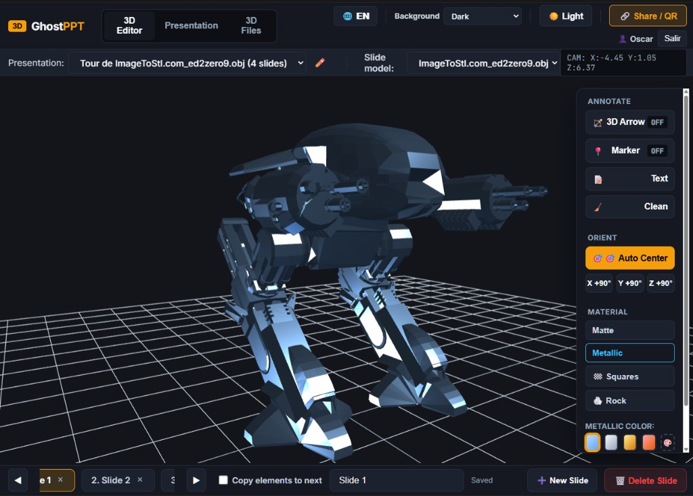
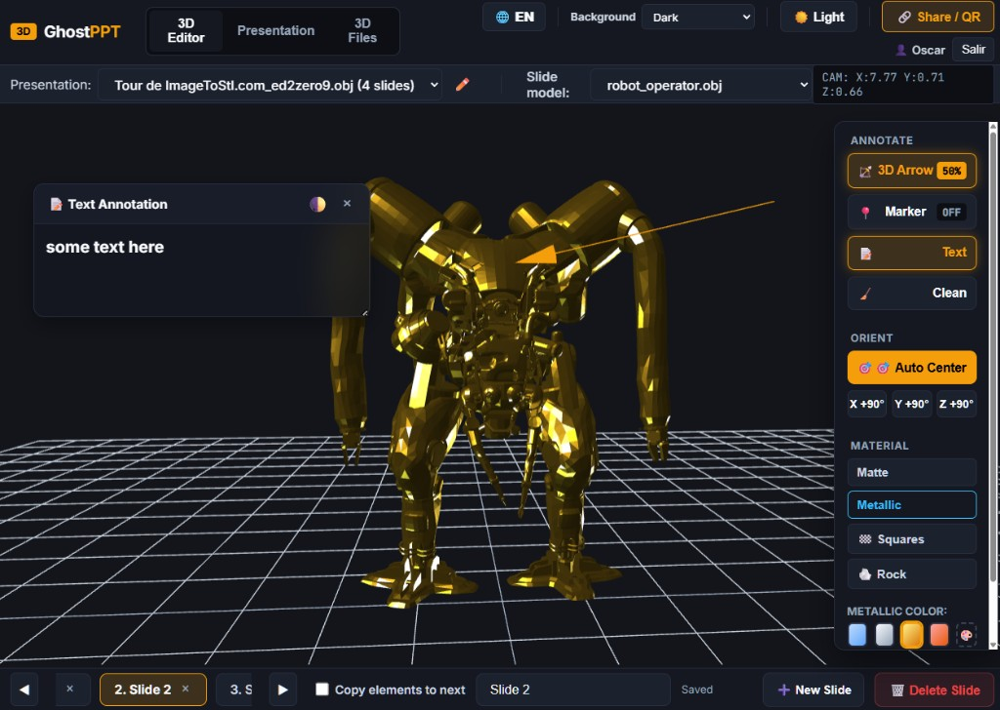

# GhostPPT 🥑

**Local-first 3D presentation studio** by [aoxilus](https://github.com/aoxilus).

Build slide decks around OBJ/STL models, annotate in 3D, and share a **viewer-only** link or QR code—no login required for the audience.

[English](README.md) · [Español](README.es.md)





## Why GhostPPT

- **One presentation, many models** — each slide can show a different STL/OBJ from your library
- **Studio for authors** — arrows, markers, notes, materials, Auto Center, camera views
- **Public playback** — Share / QR opens the viewer only (phones on the same Wi‑Fi supported)
- **Local & private by default** — Node + SQLite on your machine; no cloud account required
- **Bilingual UI** — English / Español toggle in the studio

## Quick start

```powershell
npm install
npm start
```

Open <http://localhost:3000/>.

Requires **Node.js 22+** (uses built-in `node:sqlite`).

## Typical workflow

1. **3D Files** — upload your STL/OBJ collection to the library (does not create a presentation)
2. **New Presentation** — create a deck by title
3. **Per slide** — pick the model, frame the camera, add annotations; autosave keeps it in SQLite
4. **Share / QR** — hand out the public URL or QR; students open the viewer without signing in

## Documentation

| | |
|---|---|
| English user guide | [docs/USER-GUIDE.en.md](docs/USER-GUIDE.en.md) |
| Guía en español | [docs/USER-GUIDE.es.md](docs/USER-GUIDE.es.md) |
| Wiki | [github.com/aoxilus/GhostPPT/wiki](https://github.com/aoxilus/GhostPPT/wiki) |

## Auth & sharing

- **Editor** — login required (professors create and edit)
- **Public viewer** — no login; mutations stay blocked without a session
- Initial owner username: `oscar` (password via `GHOSTPPT_INITIAL_PASSWORD` — never commit secrets)
- Session secret: `GHOSTPPT_SESSION_SECRET`

On the same Wi‑Fi, Share / QR prefers your LAN IP so phones can open the viewer.

## License

**CC BY-NC-SA 4.0** — <https://creativecommons.org/licenses/by-nc-sa/4.0/>

Open-source for learning and non-commercial use. See `LICENSE`.

Made with 🥑 by [aoxilus](https://github.com/aoxilus)
